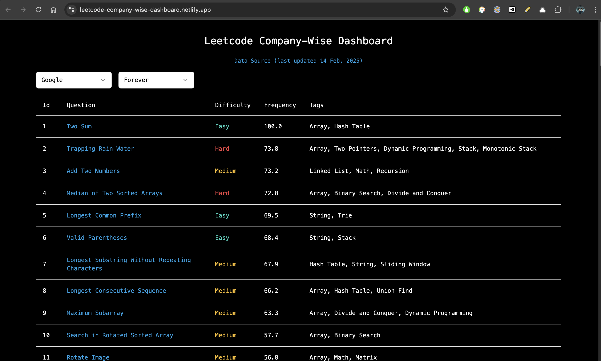

# Leetcode Company-Wise Dashboard

This website provides a cleaner UI to access the data [here](https://github.com/liquidslr/leetcode-company-wise-problems), which contains **company-specific leetcode questions** to practice.

## Note

1. The duration filter helps you see which questions have been asked in that given timeframe by companies.

2. The frequency shows you the relative frequency of questions being asked by that company in that timeframe. By default, questions are sorted in decreasing order of frequency. The most frequent question has a frequency score of `100.0`, and all other questions' frequency is determined relative to that. So, a frequency of `20.0` means it was asked 5 times less than the most frequent question.
